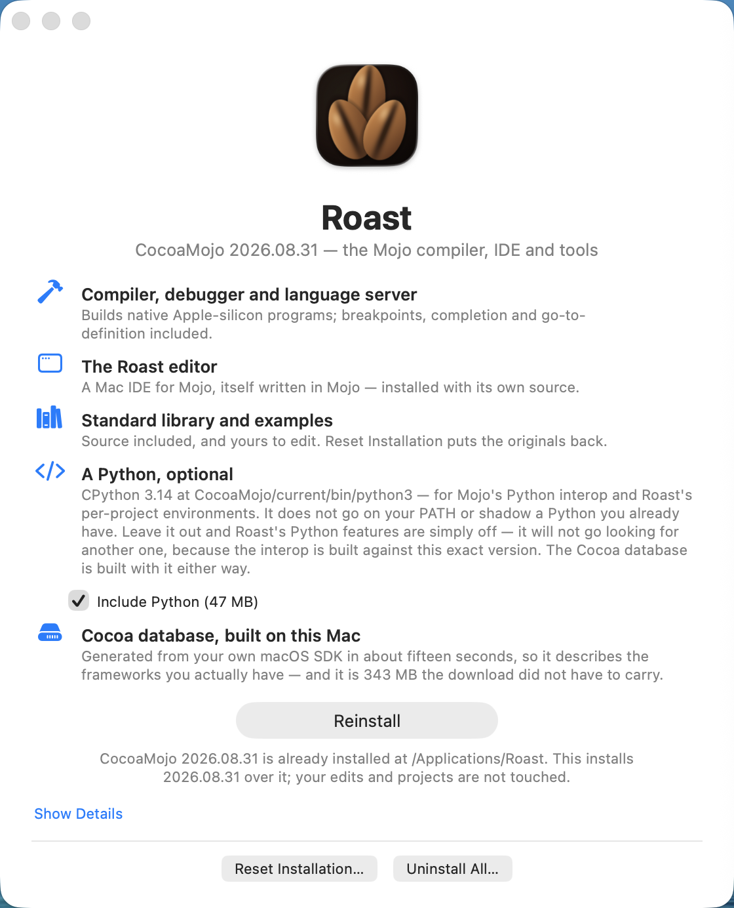

# CocoaMojo

<p align="center"></p>

**CocoaMojo is Mojo as a first-class Mac language.** One toolchain that
compiles Mojo source into native Mac applications — real windows through
AppKit, declared as Objective-C classes *in Mojo*; GPU kernels lowered
through Apple's Metal AIR; audio on CoreAudio's own thread — plus the
language server and debugger behind it, and **Roast**, a Mac IDE for Mojo
written in Mojo, which installs with its own source as the largest example
in the box.

The same source runs across the fleet: the 2019 Intel Mac Pro drives an AMD
Radeon Pro Vega II with it, and the
[Apple Silicon port](https://github.com/albanread/MojoCocoa) drives the M4's
GPU from the identical programs. Two machines, two GPU generations, one
language.

## Download

Both images are signed and notarized. Open the one for your Mac,
double-click *Install Roast*, press Install.

➡ **Apple Silicon (M-series):
[Roast-2026.08.31.1.dmg](../../releases/download/arm-2026.08.31.1/Roast-2026.08.31.1.dmg)**
— 173 MB. ([release notes](../../releases/tag/arm-2026.08.31.1))

➡ **Mac Pro 2019 (Intel Xeon, Radeon Pro Vega II):
[Roast-Intel-2026.08.31.dmg](../../releases/download/intel-2026.08.31/Roast-Intel-2026.08.31.dmg)**
— 235 MB. ([release notes](../../releases/tag/intel-2026.08.31))

Not sure which? Apple menu → About This Mac: "Apple M1/M2/M3/M4" means the
first, "Intel" the second. Picking wrong costs nothing — the installer checks
your CPU before it copies anything.

All releases: [Releases](../../releases).

---

## Supported machines

Two ports are released here, each built native and verified on its own
hardware before imaging:

  | image | machine | GPU |
  |---|---|---|
  | `Roast-Intel-<ver>.dmg` | 2019 Mac Pro — Intel Xeon (AVX-512) | AMD Radeon Pro **Vega II** |
  | `Roast-<ver>.dmg` | Apple Silicon — **M-series** (built on M4) | Apple GPU |

  **Only these, at this time.** A portable x86-64-v3 flavor for other Intel
  Macs (Radeon Pro 5300M and similar) is built and gated, but that GPU is
  **untested** — it is not released here until it has been.

  Pick the wrong image and nothing breaks silently: the installer checks
  your CPU before copying, and then *runs the compiler* as its final step —
  an image your machine can't execute fails with an explanation, not a
  crash report.

- macOS 15 or later on Apple Silicon; macOS 13 or later on the Intel image.
- ~1.5 GB free in `/Applications`. No admin password is needed —
  `/Applications` is group-writable by design.

## Installing

1. Open the DMG and double-click **Install Roast**.

   *If the image is unsigned (pre-notarization builds): right-click →
   Open the first time, or clear quarantine with*
   `xattr -d com.apple.quarantine <the .dmg>`.

2. Press **Install**. Three things happen, and the window narrates them:
   - the toolchain lands in `/Applications/Roast/CocoaMojo/<version>/`,
     beside any version already there — `current` is a symlink naming the
     one that answers;
   - the installer **proves the toolchain executes on your Mac** by running
     `cocoamojo-compiler --version` and showing you the result;
   - the Cocoa SDK database is generated **from your Mac's own frameworks**
     (~15 seconds, ~270 MB) — it describes the macOS you actually have,
     which is why it isn't shipped in the download.

3. Done. Open **Roast** from `/Applications/Roast/` (full flavor), or use
   the toolchain directly:

   ```
   /Applications/Roast/CocoaMojo/current/bin/cocoamojo --run \
       /Applications/Roast/CocoaMojo/current/share/examples/mandelbrot/main.mojo
   ```

## What gets installed, and where

Everything lands under **one folder**, `/Applications/Roast` — the installer
touches nothing else on your Mac, changes no PATH, and shadows no Python you
already have:

    /Applications/Roast/
      Roast.app                     the IDE — open this
      CocoaMojo/
        current -> 2026.08.31.1     the version that answers; a symlink
        2026.08.31.1/               a complete, self-contained toolchain:
          bin/
            cocoamojo               compile and run Mojo (--build, --run)
            cocoamojo-compiler      the compiler itself
            mojo-lsp-server         completions and diagnostics, any LSP editor
            lldb, lldb-dap          the debugger, Mojo support loaded
            python3                 the bundled CPython (reachable here, only)
          lib/
            libLLVM, libMLIR, …     one shared copy, used by every tool above
            mojo/                   the standard library, as editable source
          share/
            examples/               seventeen projects, from hello to GPU
                                    fluid dynamics and real-time audio
            ide-source/             Roast's own source — the largest example
            cocoa.sqlite            the SDK database, built on YOUR Mac at
                                    install time from your own frameworks
          Python/                   Python.framework (only if you ticked it)

Installing a newer version lands it **beside** the old one and moves the
`current` symlink — nothing is overwritten, and stepping back is one symlink.

Your own work never lives inside the install. Edited stdlib, examples, IDE
source, and the per-project Python environments Roast creates are all in

    ~/Library/Application Support/Roast/

which Uninstall leaves alone unless you explicitly tick the box.

## Reset and Uninstall

Keep the DMG. The same **Install Roast** window offers **Reset** — put a
toolchain you've experimented on back to shipped state — and **Uninstall
All**, which removes `/Applications/Roast` and nothing else. Uninstall
leaves your Application Support work alone unless you tick the box asking
it not to.

## Overview, for the curious

The toolchain is the [MojoMacX64](https://github.com/albanread/MojoMacX64)
fork: Mojo with an Objective-C `class` keyword (declare real Cocoa classes
in Mojo; the runtime calls them), typed Cocoa calls checked at compile time
against the SDK database, and GPU kernels compiled through Apple's Metal AIR
— the same source drives the Vega II on the Intel port and the Apple GPU on
the [Apple Silicon port](https://github.com/albanread/MojoCocoa). The editor,
its language server client, and its debugger adapter are all written in Mojo
itself.

Each port's release is cut on its own machine, verified by its distribution
gate before imaging, and signed and notarized.
